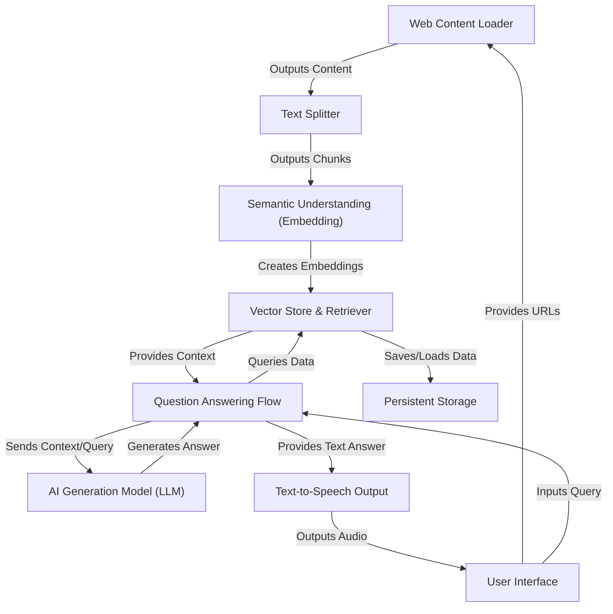

# Tutorial: BrainLinks

**BrainLinks** is an *AI-powered web intelligence tool* that analyzes web pages.
It allows users to input URLs, processes the content by breaking it down and
understanding its meaning, stores this knowledge, and then uses an *AI model*
to answer user questions based on the provided web content, even offering a
*text-to-speech output* option for the answer. 

**Link:** https://brainlinks.streamlit.app/

## Visual Overview

## Chapters

1. [User Interface
](01_user_interface_.md)
2. [Web Content Loader
](02_web_content_loader_.md)
3. [Text Splitter
](03_text_splitter_.md)
4. [Semantic Understanding (Embedding)
](04_semantic_understanding__embedding__.md)
5. [Vector Store & Retriever
](05_vector_store___retriever_.md)
6. [Persistent Storage
](06_persistent_storage_.md)
7. [Question Answering Flow
](07_question_answering_flow_.md)
8. [AI Generation Model (LLM)
](08_ai_generation_model__llm__.md)
9. [Text-to-Speech Output
](09_text_to_speech_output_.md)

---
